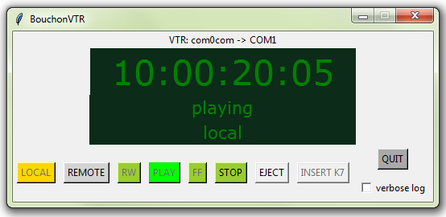

# Bouchon VTR : a Serial VTR emulator

## Utilisation

Ce bouchon simule la présence d'un **VTR** connecté à un port COM du poste.
Il réagit à toutes les commandes de PLAY et de RECORD, et simule un TIMECODE qui évolue avec le temps de façon réaliste.

## Protocole 
Selon la documentation: "BWM to MSW Protocol E2R8.pdf"

## Tests

pySerial fournit un outil (miniterm) qui permet de voir et d'envoyer des textes sur la liaison série.
On utilise le _miniterminal_ de Python avec la commande `py -m serial.tools.miniterm` (-h pour avoir l'aide), ou `miniterm.bat`.
Pour connaitre la liste des ports COM visibles: `py -m serial.tools.list_ports`

## Executable

Le fichier **setup.py** permet de générer un programme exécutable (.exe) en utilisant la librarie _cx_Freeze_.

Usage:
`compilation.bat`
ou
`py setup.py build`

##  Dependances

Les librairries Python suivantes doivent être installées:

* **Python 3.6**
* **tkinter** (pour l'interface graphique)
* **pyserial**  (`py -m pip install pyserial`)
* **cx_Freeze** (optionnel: utile seulement si on souhaite la génération d'une version exécutable)

Ainsi que l'utilitaire freeware:
* **com0com**

L'utilitaire **com0com** (_Null-modem emulator_) simule les échanges sur un port COM. 
Il est disponible sur [SourceForge](https://sourceforge.net/projects/com0com).
(Installer uniquement la gestion des ports COM.)

Par défaut, com0com ajoute deux ports série virtuels au PC (COM3 et COM4), et crée une passerelle entre les deux.
=> On configure le **bouchonVTR** sur le port **COM4** (dans `bouchonVTR.py`)
=> On configure le **Device VTR** du Device Controller sur le port **COM3** (dans `sgtDCSvr.xml`)

